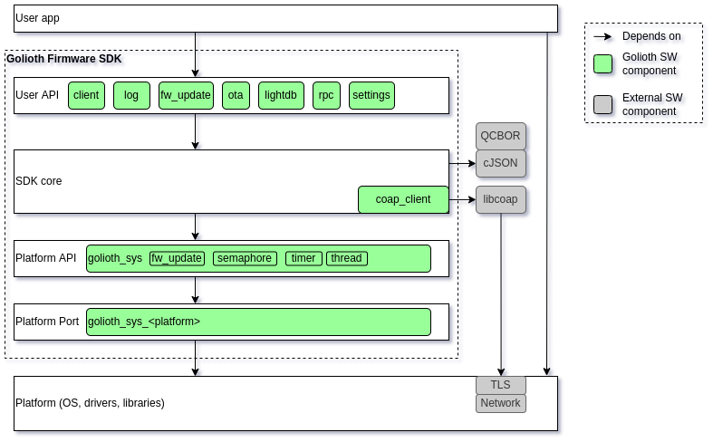

# Porting the SDK

This guide might help you port the Golioth SDK to new platforms.

## Architecture Overview

The structural architecture of the SDK is depicted below:



There are 4 main layers in the SDK:

1. User API: These are the header files in `src/include` that represent the entire
   surface area of the user-facing API (types and functions the user can call).
2. SDK core: The `.c` files in `src`. Contains a CoAP client implementation (based
   on `libcoap`), and implements the User API layer. This is where most of the
   actual work is happening in the SDK.
3. Platform API: Abstraction layer for the platform and OS. This makes it easier
   to port the SDK core to different OSes and platforms. This API is defined
   in `src/include/golioth_sys.h` and `src/include/golioth_fw_update.h`.
   The SDK depends on this API for creating semaphores, timers, threads, and for
   applying firmware updates (e.g. with MCUboot).
4. Platform Port: This is the implementation of the Platform API for a specific
   platform. These are the files in `port/<platform>`. There are multiple platform
   ports to choose from, but a specific user app will only use one (e.g. an ESP-IDF
   app will use the ESP-IDF port).

The SDK has three direct external dependencies:

1. `libcoap`: Implements CoAP client protocol
2. `cJSON`: Serialization of application layer data in JSON format
3. `QCBOR`: Serialization of application layer data in CBOR format

The `libcoap` library has its own dependencies on TLS and networking libraries.
For new ports, it may be necessary to also port `libcoap` to the platform.
This will not be a large effort if the platform already supports `mbedtls` for TLS
and either POSIX sockets or `lwip` for networking.

## Directory Structure

```
docs/                         # Doxygen and documentation
examples/                     # Example apps
  <platform>                  # <platform>-specific example apps
    golioth_basics/           # The golioth_basics example. Every platform should have one.
    ...
external/                     # External dependencies
port/                         # Platform ports
  <platform>/
    libcoap/                  # (optional) port of libcoap to <platform>
    CMakeLists.txt            # Platform-specific build file (could also be Makefile)
    fw_update_<platform>.c    # Port of golioth_fw_update.h to <platform>
    golioth_sys_<platform>.c  # Port of golioth_sys.h to <platform>
scripts/                      # Misc. scripts
src/                          # Core SDK code, platform-agnostic, only .h and .c files
test/                         # Unit tests
```

## Porting Process Overview

The porting process is broken down into 2 main steps:

1. Get a basic "Hello, World" project compiling and running
    - Contains minimal `main.c` that includes Golioth SDK.
    - Port layer will be entirely stubs and empty files, just enough
      to get the app to compile and run.
    - Will need to include libcoap in the project, so header
      files can be resolved (Golioth SDK depends on libcoap headers).

2. Get the `golioth_basics` example compiling and running
    - Full implementation of port layer
        - golioth_sys
        - fw_update

When in doubt, use the existing platform examples and ports as a reference.
The existing `linux` port is the simplest to understand, so it may make sense
to study that one first (`port/linux` and `examples/linux`).

## Create Hello, World project with golioth_sdk

Create a folder for the `hello_world` project:

```
mkdir examples/<platform>/hello_world
```

Add a `main.c` file with the following contents:

```c
#include "golioth.h"
#include <stdio.h>

#define TAG "main"

int main(void) {
    GLTH_LOGI(TAG, "Hello, World!");
    return 0;
}
```

Add build files (e.g. CMakeLists.txt) to build the project on your
platform.

It's recommended to build the SDK core (the files in `src`)
as a library, then link that library into the top-level executable.
You can see an example of this being done in `port/esp_idf/components/golioth_sdk`
and `port/linux/golioth_sdk`.

### Create empty files

When you try to compile your "Hello, World" project, you will get
missing header files and unresolved references.

You will need to create the following files:

```
touch port/<platform>/golioth_port_config.h
touch port/<platform>/fw_update_<platform>.c
touch port/<platform>/golioth_sys_<platform>.c
```

You can also use an existing version of these files if it works for
your platform. For instance, if your platform has support for FreeRTOS, then
you could use `port/freertos/golioth_sys_freertos.c`. Likewise, if your platform
supports MCUboot, you could use `port/modus_toolbox/fw_update_mcuboot.c`.

### Stubs for `golioth_sys_<platform>` and `fw_update_<platform>`

Create stub implementations of the required functions to get the project
to properly link.

These are all of the functions declared in `src/include/golioth_sys.h` and
in `src/include/golioth_fw_update.h` (the ones with prefix `fw_update_`).

golioth_sys required functions:
```
void golioth_sys_msleep(uint32_t ms);
uint64_t golioth_sys_now_ms(void);
golioth_sys_sem_t golioth_sys_sem_create(uint32_t sem_max_count, uint32_t sem_initial_count);
bool golioth_sys_sem_take(golioth_sys_sem_t sem, int32_t ms_to_wait);
bool golioth_sys_sem_give(golioth_sys_sem_t sem);
void golioth_sys_sem_destroy(golioth_sys_sem_t sem);
golioth_sys_timer_t golioth_sys_timer_create(golioth_sys_timer_config_t config);
bool golioth_sys_timer_start(golioth_sys_timer_t timer);
bool golioth_sys_timer_reset(golioth_sys_timer_t timer);
void golioth_sys_timer_destroy(golioth_sys_timer_t timer);
golioth_sys_thread_t golioth_sys_thread_create(golioth_sys_thread_config_t config);
void golioth_sys_thread_destroy(golioth_sys_thread_t thread);
```

fw_update required functions:
```
bool fw_update_is_pending_verify(void);
void fw_update_rollback(void);
void fw_update_reboot(void);
void fw_update_cancel_rollback(void);
golioth_status_t fw_update_handle_block(
        const uint8_t* block,
        size_t block_size,
        size_t offset,
        size_t total_size);
void fw_update_post_download(void);
golioth_status_t fw_update_validate(void);
golioth_status_t fw_update_change_boot_image(void);
void fw_update_end(void);
```

### Compile and Run Hello, World

With the required files and stub implementations in place, you should
be able to compile and run the `hello_world` project on your target platform.

The output should be:

```
I (0) main: Hello, World!
```

## Create golioth_basics project

Rename the "Hello, World" project to `golioth_basics` and include these
files in the build

```
examples/common/golioth_basics.h
examples/common/golioth_basics.c
```

Change your `main.c` file to match this:

```c
#include "golioth.h"
#include "golioth_basics.h"
#include <stdio.h>
#include <string.h>

#define TAG "main"

int main(void) {
    const char* wifi_ssid = "SSID";
    const char* wifi_password = "Password";
    const char* golioth_psk_id = "device@project";
    const char* golioth_psk = "supersecret";

    // TODO: hardware init
    //  e.g. non-volatile storage, wifi

    // TODO: wait for connection to network

    golioth_client_config_t config = {
        .credentials = {
            .auth_type = GOLIOTH_TLS_AUTH_TYPE_PSK,
            .psk = {
                    .psk_id = golioth_psk_id,
                    .psk_id_len = strlen(golioth_psk_id),
                    .psk = golioth_psk,
                    .psk_len = strlen(golioth_psk),
            }
        }
    };

    golioth_client_t client = golioth_client_create(&config);
    assert(client);
    golioth_basics(client);

    return 0;
}
```

You will need to fill in those `TODO`s with your platform-specific
hardware and network initialization code.

## Implement golioth_sys port

You'll need to fill in the implementation of `golioth_sys_<platform>.c` functions
based on your platform's libararies for semaphores, timers, and threads.
If your platform supports POSIX or FreeRTOS, you should try to use the existing
ports (e.g. `port/freertos/golioth_sys_freertos.c`).

After you implement `golioth_sys`, you should be able to run the `golioth_basics`
app again, and it should connect to Golioth servers (assuming you have set
the proper Golioth credentials in `main.c`).

## Implement fw_update port

The final step is to implement the `fw_update` port, which handles the platform
side of OTA firmware updates. This entails writing the OTA image to flash,
notifying the bootloader to use the new image, and rolling back to prior boot
images. See the Doxygen descriptions in `src/include/golioth_fw_update.h` for
more details.

If your platform supports MCUboot, you can leverage
`port/modus_toolbox/fw_update_mcuboot.c` instead of writing from scratch.
